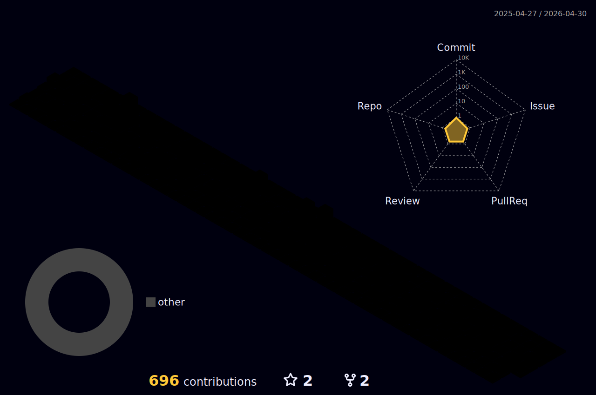

  
# Hello, folks! 
### Love to know how everything works.

 

#### - Desenvolvedor Front-end, mas que também estuda o lado Back-end da questão.  
##### Meus interesses principais em Front-end são:

##### Em back-end, eu me aventuro por:

##### Quando o assunto é Database, normalmente eu opto por:

##### E tambem já fiz testes com:

  
## Contato

  

 

<!--
**gabrigomez/gabrigomez** is a ✨ _special_ ✨ repository because its `README.md` (this file) appears on your GitHub profile.

Here are some ideas to get you started:

- 🔭 I’m currently working on ...
- 🌱 I’m currently learning ...
- 👯 I’m looking to collaborate on ...
- 🤔 I’m looking for help with ...
- 💬 Ask me about ...
- 📫 How to reach me: ...
- 😄 Pronouns: ...
- ⚡ Fun fact: ...
-->
